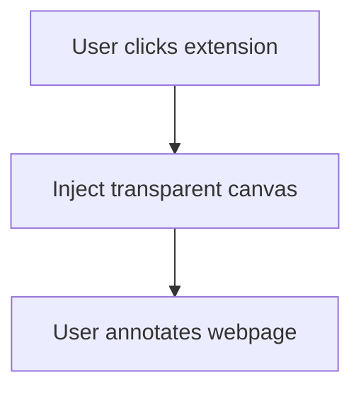

# Chrome Extension: Transparent Annotation Overlay

A comprehensive guide to building a Chrome extension that overlays a transparent annotation canvas on any webpage, lets users annotate directly.

---

## 📋 Features Overview

- **Transparent Overlay:** Inject a transparent canvas over the current webpage.
- **Annotate Directly:** Draw, highlight, or add text directly on the webpage.

---

## 🧩 Updated Architecture Diagram



---

## 🛠️ Tech Stack

| Component             | Technology                     |
|-----------------------|--------------------------------|
| Browser Extension     | Chrome Extensions API          |
| Overlay & Annotation  | HTML Canvas API                |

---

## 🧑‍💻 Complete Implementation

### 1. **`manifest.json`**

```json
{
  "manifest_version": 3,
  "name": "Transparent Screenshot Annotator",
  "version": "1.0",
  "permissions": ["activeTab", "scripting", "storage"],
  "host_permissions": ["<all_urls>"],
  "action": {
    "default_title": "Annotate Page",
    "default_icon": "icon.png"
  },
  "background": {
    "service_worker": "background.js"
  },
  "web_accessible_resources": [
    {
      "resources": ["content.js", "js/textWidget.js", "js/uiElements.js", "js/drawingTools.js"],
      "matches": ["<all_urls>"]
    }
  ]
}
```

---

### 2. **`background.js`**

Injects the content script when the extension icon is clicked.

```js
chrome.action.onClicked.addListener((tab) => {
  chrome.scripting.executeScript({
    target: { tabId: tab.id },
    files: ["content.js"]
  });
});
```

---

### 3. **`content.js`**

Injects a transparent canvas overlay and provides annotation tools.

```js
(async function() {
  // Avoid multiple injections
  if (window.__annotatorInjected) return;
  window.__annotatorInjected = true;

  // Load necessary scripts (e.g., textWidget.js, uiElements.js, drawingTools.js)
  // Assume these are loaded via web_accessible_resources
  const { createTextWidget, removeTextWidget, setAnnotations, setRedrawFunction } = await import(chrome.runtime.getURL('js/textWidget.js'));
  const { createUIElements, Z_INDEX } = await import(chrome.runtime.getURL('js/uiElements.js'));
  const { startDrawing, draw, redrawAnnotations, startShape, updateShape, endShape, drawShape } = await import(chrome.runtime.getURL('js/drawingTools.js'));

  // Constants (COLORS, TOOLS)
  // ... state management ...
  // ... createUIElements call ...
  // ... setup event listeners ...

  // Add simple toolbar
  const toolbar = document.createElement('div');
  toolbar.style.position = 'fixed';
  toolbar.style.top = '10px';
  toolbar.style.right = '10px';
  toolbar.style.zIndex = 1000000;
  toolbar.style.background = '#fff';
  toolbar.style.padding = '8px';
  toolbar.style.borderRadius = '4px';
  toolbar.style.boxShadow = '0 0 5px rgba(0,0,0,0.3)';
  toolbar.style.fontFamily = 'sans-serif';
  toolbar.innerHTML = `
    <button id="draw">Draw</button>
    <input type="color" id="color-picker" value="#ff0000" title="Drawing Color">
    <button id="shapes">Shapes</button>
    <button id="text">Text</button>
    <button id="eraser">Eraser</button>
    <button id="clear">Clear</button>
    <button id="close">Close</button>
  `;
  document.body.appendChild(toolbar);

  // Tool actions (Draw, Text, Shapes, Eraser, Clear, Close)
  // ... (event listeners for buttons as in current implementation)

})();
```

---

## 🔒 Security Considerations

- **Data Privacy:** Inform users if any data is stored locally (e.g., via `chrome.storage`).

---

## 🎨 UI Mockup


---

## 🚀 Future Enhancements

- User authentication (if needed)
- Option to save/load annotations locally
- More annotation tools (arrows, etc.)
- Export annotations (e.g., as JSON)

---

## 📚 References

- [Chrome Extensions Developer Guide](https://developer.chrome.com/docs/extensions/)
- [HTML Canvas API](https://developer.mozilla.org/en-US/docs/Web/API/Canvas_API)

---

## 🎉 Conclusion

This enhanced Chrome extension allows users to annotate directly over webpages with a transparent overlay.