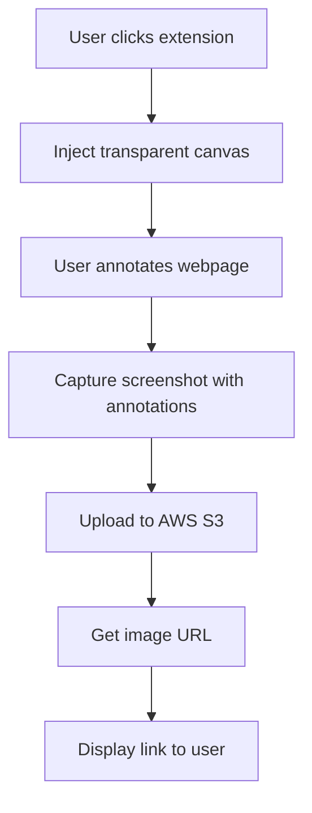

# Chrome Extension: Transparent Annotation Overlay with Screenshot & AWS Upload

A comprehensive guide to building a Chrome extension that overlays a transparent annotation canvas on any webpage, lets users annotate directly, captures the final screenshot, uploads it to AWS S3, and retrieves the image link.

---

## 📋 Features Overview

- **Transparent Overlay:** Inject a transparent Fabric.js canvas over the current webpage.
- **Annotate Directly:** Draw, highlight, or add text directly on the webpage.
- **Capture Annotated Screenshot:** Take a screenshot including the annotations.
- **Upload to AWS S3:** Save the screenshot securely to an AWS S3 bucket.
- **Retrieve Link:** Display the public URL of the uploaded image.

---

## 🧩 Updated Architecture Diagram



---

## 🛠️ Tech Stack

| Component             | Technology                     |
|-----------------------|--------------------------------|
| Browser Extension     | Chrome Extensions API          |
| Overlay & Annotation  | Fabric.js                      |
| Screenshot Capture    | `html2canvas`                  |
| Backend Storage       | AWS S3                         |
| AWS Integration       | AWS SDK (JavaScript)           |

---

## 🧑‍💻 Complete Implementation

### 1. **`manifest.json`**

```json
{
  "manifest_version": 3,
  "name": "Transparent Screenshot Annotator",
  "version": "1.0",
  "permissions": ["activeTab", "scripting", "storage"],
  "host_permissions": ["<all_urls>"],
  "action": {
    "default_title": "Annotate Page",
    "default_icon": "icon.png"
  },
  "background": {
    "service_worker": "background.js"
  },
  "web_accessible_resources": [
    {
      "resources": ["content.js", "fabric.min.js", "html2canvas.min.js"],
      "matches": ["<all_urls>"]
    }
  ]
}
```

---

### 2. **`background.js`**

Injects the content script when the extension icon is clicked.

```js
chrome.action.onClicked.addListener((tab) => {
  chrome.scripting.executeScript({
    target: { tabId: tab.id },
    files: ["content.js"]
  });
});
```

---

### 3. **`content.js`**

Injects a transparent Fabric.js canvas overlay, provides annotation tools, and handles screenshot + upload.

```js
(async function() {
  // Avoid multiple injections
  if (window.__annotatorInjected) return;
  window.__annotatorInjected = true;

  // Load Fabric.js and html2canvas dynamically if not present
  const loadScript = (src) => new Promise((resolve) => {
    const s = document.createElement('script');
    s.src = src;
    s.onload = resolve;
    document.head.appendChild(s);
  });

  if (!window.fabric) await loadScript('https://cdnjs.cloudflare.com/ajax/libs/fabric.js/5.3.0/fabric.min.js');
  if (!window.html2canvas) await loadScript('https://cdnjs.cloudflare.com/ajax/libs/html2canvas/1.4.1/html2canvas.min.js');

  // Create overlay container
  const overlay = document.createElement('div');
  overlay.style.position = 'fixed';
  overlay.style.top = 0;
  overlay.style.left = 0;
  overlay.style.width = '100%';
  overlay.style.height = '100%';
  overlay.style.zIndex = 999999;
  overlay.style.pointerEvents = 'none'; // Allow clicks to pass through initially
  overlay.style.background = 'rgba(0,0,0,0.0)';
  document.body.appendChild(overlay);

  // Create canvas element
  const canvasEl = document.createElement('canvas');
  canvasEl.id = 'annotationCanvas';
  canvasEl.width = window.innerWidth;
  canvasEl.height = window.innerHeight;
  overlay.appendChild(canvasEl);

  // Initialize Fabric.js canvas
  const canvas = new fabric.Canvas('annotationCanvas', {
    backgroundColor: 'transparent',
    selection: true
  });

  overlay.style.pointerEvents = 'auto'; // Enable interaction

  // Add simple toolbar
  const toolbar = document.createElement('div');
  toolbar.style.position = 'fixed';
  toolbar.style.top = '10px';
  toolbar.style.right = '10px';
  toolbar.style.zIndex = 1000000;
  toolbar.style.background = '#fff';
  toolbar.style.padding = '8px';
  toolbar.style.borderRadius = '4px';
  toolbar.style.boxShadow = '0 0 5px rgba(0,0,0,0.3)';
  toolbar.style.fontFamily = 'sans-serif';
  toolbar.innerHTML = `
    <button id="draw">Draw</button>
    <button id="text">Text</button>
    <button id="clear">Clear</button>
    <button id="save">Save</button>
    <button id="close">Close</button>
  `;
  document.body.appendChild(toolbar);

  // Tool actions
  document.getElementById('draw').onclick = () => {
    canvas.isDrawingMode = true;
    canvas.freeDrawingBrush.width = 3;
    canvas.freeDrawingBrush.color = 'red';
  };

  document.getElementById('text').onclick = () => {
    canvas.isDrawingMode = false;
    const text = new fabric.IText('Text here', {
      left: 50,
      top: 50,
      fill: 'blue',
      fontSize: 20
    });
    canvas.add(text).setActiveObject(text);
  };

  document.getElementById('clear').onclick = () => {
    canvas.clear();
    canvas.backgroundColor = 'transparent';
  };

  document.getElementById('close').onclick = () => {
    overlay.remove();
    toolbar.remove();
    window.__annotatorInjected = false;
  };

  document.getElementById('save').onclick = async () => {
    // Hide toolbar before screenshot
    toolbar.style.display = 'none';

    // Render Fabric canvas to data URL
    const annotationDataUrl = canvas.toDataURL({
      format: 'png',
      multiplier: 1
    });

    // Capture the page with annotations
    const screenshotCanvas = await html2canvas(document.body, {
      backgroundColor: null,
      useCORS: true,
      allowTaint: true,
      logging: false,
      onclone: (clonedDoc) => {
        // Inject the annotation image overlay into the cloned DOM
        const img = clonedDoc.createElement('img');
        img.src = annotationDataUrl;
        img.style.position = 'fixed';
        img.style.top = '0';
        img.style.left = '0';
        img.style.width = '100%';
        img.style.height = '100%';
        img.style.zIndex = 999999;
        clonedDoc.body.appendChild(img);
      }
    });

    screenshotCanvas.toBlob(async (blob) => {
      // Upload to AWS S3
      await uploadToS3(blob);
    }, 'image/png');

    // Restore toolbar
    toolbar.style.display = 'block';
  };

  async function uploadToS3(blob) {
    // Load AWS SDK dynamically
    if (!window.AWS) {
      await loadScript('https://sdk.amazonaws.com/js/aws-sdk-2.1481.0.min.js');
    }

    AWS.config.update({
      accessKeyId: 'YOUR_ACCESS_KEY',
      secretAccessKey: 'YOUR_SECRET_KEY',
      region: 'YOUR_REGION'
    });

    const s3 = new AWS.S3();
    const params = {
      Bucket: 'YOUR_BUCKET_NAME',
      Key: `annotated-${Date.now()}.png`,
      Body: blob,
      ContentType: 'image/png',
      ACL: 'public-read'
    };

    s3.upload(params, function(err, data) {
      if (err) {
        alert('Upload failed: ' + err.message);
        console.error(err);
      } else {
        alert('Uploaded! URL:\n' + data.Location);
        window.open(data.Location, '_blank');
      }
    });
  }
})();
```

---

## 🔒 Security Considerations

- **Credentials:** Use IAM roles and temporary credentials (e.g., Cognito Identity Pools) instead of hardcoding keys.
- **Bucket Policy:** Ensure your S3 bucket allows appropriate access (public-read or signed URLs).
- **Data Privacy:** Inform users about data storage and access.

---

## 🎨 UI Mockup


---

## 🚀 Future Enhancements

- User authentication
- History of uploaded images
- More annotation tools (shapes, colors)
- Export to PDF
- Integration with other storage providers

---

## 📚 References

- [Chrome Extensions Developer Guide](https://developer.chrome.com/docs/extensions/)
- [Fabric.js Documentation](http://fabricjs.com/)
- [html2canvas Documentation](https://html2canvas.hertzen.com/)
- [AWS SDK for JavaScript](https://docs.aws.amazon.com/sdk-for-javascript/)
- [Uploading Files to S3](https://docs.aws.amazon.com/AmazonS3/latest/userguide/upload-objects.html)

---

## 🎉 Conclusion

This enhanced Chrome extension allows users to annotate directly over webpages with a transparent overlay, capture the final annotated screenshot, and share it effortlessly via AWS S3.