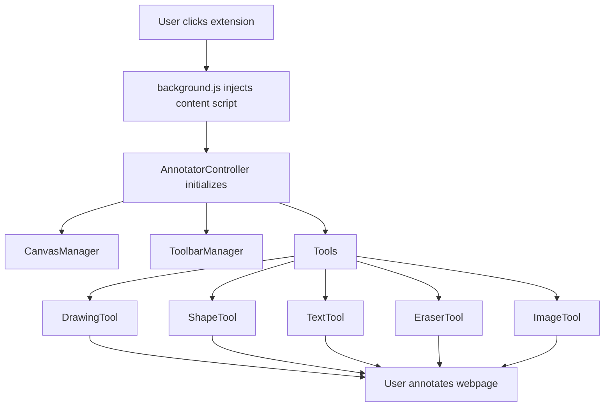

# Chrome Extension: Transparent Annotation Overlay

A comprehensive guide to the Chrome extension that overlays a transparent annotation canvas on any webpage, allowing users to annotate directly on web content.

---

## 📋 Features Overview

- **Transparent Overlay:** Inject a transparent canvas over the current webpage.
- **Multiple Annotation Tools:**
  - Freehand Drawing: Draw anywhere on the page
  - Text Tool: Add text annotations 
  - Shape Tool: Create rectangles, circles, lines, and arrows
  - Image Tool: Add images to the overlay
  - Eraser Tool: Remove parts of annotations
- **Interactive Elements:** 
  - Resize, move, and edit existing annotations
  - Color selection for drawings and shapes
  - Toolbar positioning via drag and drop

---

## 🧩 Architecture Diagram



---

## 🛠️ Tech Stack

| Component             | Technology                     |
|-----------------------|--------------------------------|
| Browser Extension     | Chrome Extensions API (MV3)    |
| Overlay & Annotation  | HTML Canvas API                |
| Architecture          | OOP JavaScript (ES Modules)    |
| Drawing               | PerfectFreehand algorithm      |

---

## 🧑‍💻 Implementation Details

### Core Architecture

The extension follows an object-oriented architecture with clear separation of concerns:

1. **AnnotatorController**: Main orchestrator that initializes and coordinates all components
2. **Managers**:
   - **CanvasManager**: Handles canvas creation, rendering, and event management
   - **ToolbarManager**: Creates and manages the UI toolbar and its interactions
3. **Tools**:
   - **DrawingTool**: Implements freehand drawing functionality
   - **ShapeTool**: Handles creation and manipulation of shapes (rectangles, circles, lines, arrows)
   - **TextTool**: Manages text annotations and editing
   - **EraserTool**: Implements eraser functionality
   - **ImageTool**: Handles image upload and placement
4. **Utilities**:
   - **constants.js**: Defines application constants and default state
   - **drawingUtils.js**: Drawing-related utility functions
   - **geometryUtils.js**: Geometry calculations for shapes
   - **perfectFreehand.js**: Algorithm for smooth freehand drawing

### Key Files

#### `manifest.json`

The manifest defines extension metadata, permissions, and resource access:

```json
{
  "manifest_version": 3,
  "name": "Transparent Screenshot Annotator",
  "version": "1.1",
  "description": "Overlay a transparent annotation canvas on any webpage (OOP Refactor)",
  "permissions": ["activeTab", "scripting"],
  "host_permissions": ["<all_urls>"],
  "action": {
    "default_title": "Annotate Page",
    "default_icon": {/* icon definitions */}
  },
  "background": {
    "service_worker": "background.js"
  },
  "web_accessible_resources": [
    {
      "resources": [
          "content.js",
          "src/js/core/AnnotatorController.js",
          "src/js/core/CanvasManager.js",
          "src/js/core/ToolbarManager.js",
          "src/js/tools/DrawingTool.js",
          "src/js/tools/ShapeTool.js",
          "src/js/tools/EraserTool.js",
          "src/js/tools/TextTool.js",
          "src/js/tools/ImageTool.js",
          "src/js/utils/constants.js",
          "src/js/utils/drawingUtils.js",
          "src/js/utils/geometryUtils.js",
          "src/js/utils/perfectFreehand.js"
      ],
      "matches": ["<all_urls>"]
    }
  ]
}
```

#### `background.js`

Implements a `BackgroundController` that:
- Responds to extension icon clicks
- Ensures the content script is injected only once per tab
- Handles any extension-level messaging

#### `content.js`

Entry point script that:
- Prevents multiple injections with a global flag
- Dynamically imports the AnnotatorController
- Initializes the application

#### `AnnotatorController.js`

The central controller that:
- Initializes all managers and tools
- Maintains application state
- Provides methods for tool activation, annotation management, and cleanup
- Coordinates communication between components

---

## 🔒 Security Considerations

- **Injection Protection:** The extension uses checks to prevent multiple injections
- **DOM Isolation:** Canvas overlay doesn't interfere with page content
- **No External Dependencies:** All code is self-contained within the extension

---

## 🚀 Future Enhancements

- **Save/Load Annotations:** Ability to save annotations for later editing
- **Annotation Export:** Export annotations as images or JSON data
- **Enhanced Text Formatting:** Additional text styling options
- **Annotation Groups:** Group related annotations together
- **Undo/Redo:** Add support for action history
- **Collaboration:** Real-time shared annotations (would require backend)

---

## 📚 References

- [Chrome Extensions Developer Guide](https://developer.chrome.com/docs/extensions/)
- [HTML Canvas API](https://developer.mozilla.org/en-US/docs/Web/API/Canvas_API)
- [Perfect Freehand](https://github.com/steveruizok/perfect-freehand)

---

## 🎉 Conclusion

This enhanced Chrome extension allows users to annotate directly over webpages with a transparent overlay.